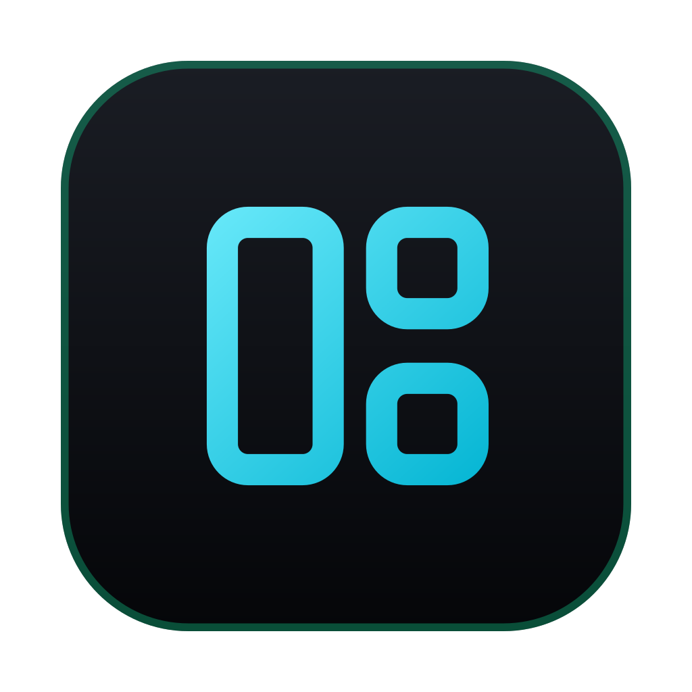

# Restore AI Windows

Reopen your [Claude Code](https://claude.com/claude-code) sessions after a crash, restart, or reboot — as iTerm2 windows **grouped by project** (one tab per session), each running `claude --resume`, put back at their **saved position, size, and virtual desktop**. The trust and "resume from summary" prompts are auto-answered, and each session is handed a prompt so it summarizes and **continues where it left off**.



## What you get

| Piece | What it does |
| --- | --- |
| **Dock app** | Click **Restore AI Windows** → reopens your last active session set |
| **Auto-restore** | A launchd agent restores automatically at every login |
| **Snapshot** | A launchd agent records active sessions **and window geometry** every 2 min |
| **Claude Code skill** | Say *"restore my sessions"* inside Claude Code to run it hands-free |
| **Browser restore** | Reopens your browser windows too — tabs **grouped into their original windows**, on their saved Space, position, and size |

On restore, each session:

- opens in a per-project window (`~/Sites/<project>/…` → one window per `<project>`, one tab each), friendly project name shown in the iTerm **badge**;
- returns to its saved **position + size**, and its **virtual desktop / Space** (best-effort — see below);
- skips the **"Is this a project you trust?"** prompt (pre-seeded in `~/.claude.json`, with a keystroke fallback) and auto-picks **Resume from summary**;
- receives the text in `scripts/continue-prompt.txt` so it reports Client/Project/Mission/Goals/Tasks and carries on, stopping only for human-in-the-loop blockers.

## Browser sessions

Alongside your iTerm Claude Code sessions, the restorer snapshots and reopens your **browser** windows ([BrowserOS](https://browseros.com), a Chromium fork — any Chromium-family browser with AppleScript window/tab scripting works). It records each open window's **tabs, window grouping, geometry, and virtual desktop / Space**, then on restore opens one window per saved group, sets its position and size, and moves it back to its Space (best-effort — same Screen Recording requirement as below; without it, geometry restores and the Space is skipped).

`claude-session-restore.sh` flags:

- (default) — restore iTerm sessions **and** browser windows
- `--browser` — restore browser windows only
- `--all` — restore both (explicit)
- `RESTORE_SKIP_BROWSER=1` — restore iTerm only (opt out of browser)

## Install

```bash
git clone https://github.com/s3w47m88/claude-session-restorer.git
cd claude-session-restorer
bash install.sh
```

Requirements: macOS, [iTerm2](https://iterm2.com), the `claude` CLI on your PATH, `python3`, and Xcode Command Line Tools (`clang`, for the Spaces helper). The installer creates a Python venv with the `iterm2` module and enables iTerm2's Python API.

### One manual step for Space restore

Restoring the **virtual desktop** needs Screen Recording permission (to map iTerm windows to a Space). After install:

**System Settings → Privacy & Security → Screen Recording** → add **Restore AI Windows** (and **iTerm**).

Without it, position and size still restore; the Space is recorded/applied as `-1` (no move).

## How it works

Claude Code stores each session as a JSONL transcript under `~/.claude/projects/<slug>/<id>.jsonl` that records the session's `cwd`. The snapshot reads the most-recent `cwd` from every recently-modified transcript (→ `active.tsv`) and, while iTerm is up, captures each project window's frame + Space (→ `geometry.tsv`). The restore driver groups by project, resumes each session, drives the prompts, restores geometry, and injects the continue-prompt — all over the iTerm2 Python API.

- `scripts/claude-session-list.sh [minutes]` — list restorable sessions
- `scripts/claude-session-snapshot.sh` — write `active.tsv` + run the geometry snapshot
- `scripts/claude-geometry-snapshot.py` — capture per-project position/size/Space
- `scripts/claude-session-restore.sh [--force]` — guard + launch iTerm, then run the driver
- `scripts/claude-restore-driver.py` — the engine (grouping, resume, prompts, geometry, continue)
- `scripts/spacesctl/spacesctl.m` — private-CGS Spaces helper (compiled by the installer)
- `scripts/continue-prompt.txt` — the prompt injected into each restored session
- `scripts/build-restorer-app.sh` — (re)build the Dock app

## Manual use

```bash
bash ~/.claude/scripts/claude-session-restore.sh --force   # restore the last snapshot now
bash ~/.claude/scripts/claude-session-list.sh              # list what would be restored
```

## Notes

- **iTerm2 only.** The automation targets iTerm2's Python API.
- **Activity window.** The snapshot captures sessions active in the last ~15 min; an idle-but-open window may not be in the set.
- **Spaces are best-effort** and use private CoreGraphics APIs; they can change across macOS releases.

## Uninstall

```bash
launchctl unload ~/Library/LaunchAgents/com.theportlandcompany.claude-{snapshot,restore}.plist
rm ~/Library/LaunchAgents/com.theportlandcompany.claude-{snapshot,restore}.plist
rm -rf "/Applications/Restore AI Windows.app" ~/.claude/skills/restore-claude-sessions
# scripts in ~/.claude/scripts (incl. itermvenv) and state in ~/.claude/session-state can be removed too
```

## License

MIT
